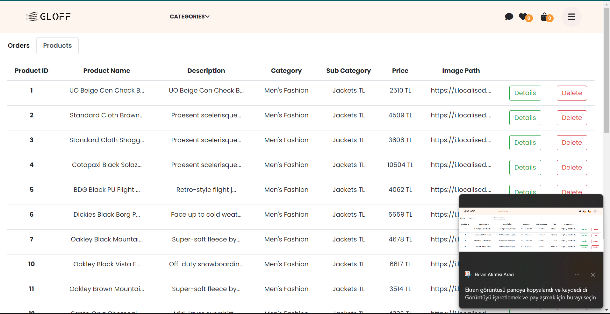

# Inveon-Final-Project
E-Commerce Application Using React.js and .Net Core

    <h3><strong>ACTORS : </strong>Admin, Customer</h3>
    <h3><strong>Implemented Use Cases: </strong></h3>
    <ul>
        <li>Login (Admin, Customer)</li>
      <li>Logout (Admin, Customer)</li>
      <li>View All Products (Admin, Customer)</li>
      <li>Filter Products includes Filter by Category, Filter by Price, Filter by Name (Customer)</li>
      <li>Add to Favorites (Customer))</li>
      <li>Remove From Favorites (Customer)</li>
      <li>Clear Favorites (Customer)</li>
      <li>Add to Basket (Customer)</li>
      <li>Remove From Basket (Customer)</li>
      <li>Clear Basket (Customer)</li>
      <li>Update Basket (Customer)</li>
      <li>Checkout (Customer)</li>
      <li>View Completed Orders (Customer)</li>
      <li>View Order Details (Admin, Customer)</li>
      <li>View All Orders  (Admin)</li>
      <li>View All Product Details (Admin, Customer) => Admin uses both his/her panel and product cards just for this version. Customers can view details by the category page</li>
      <li>Send Message (Admin, Customer)</li>
      <li>Receive Message extends View Message (Admin, Customer)</li>
    </ul>
    

         <h3><strong>Screenshots : </strong></h3>
        <table>
          <tr>
            <td></td>
            <td></td>
          </tr>
          <tr>
            <td></td>
            <td></td>
          </tr>
           <tr>
            <td></td>
            <td></td>
          </tr>
          <tr>
            <td></td>
            <td></td>
          </tr>
           <tr>
            <td></td>
            <td></td>
          </tr>
           <tr>
            <td></td>
            <td></td>
          </tr>
          <tr>
            <td></td>
            <td></td>
          </tr>
          <tr>
            <td></td>
            <td></td>
          </tr>
           <tr>
            <td></td>
            <td></td>
          </tr>
            
        </table>
        

